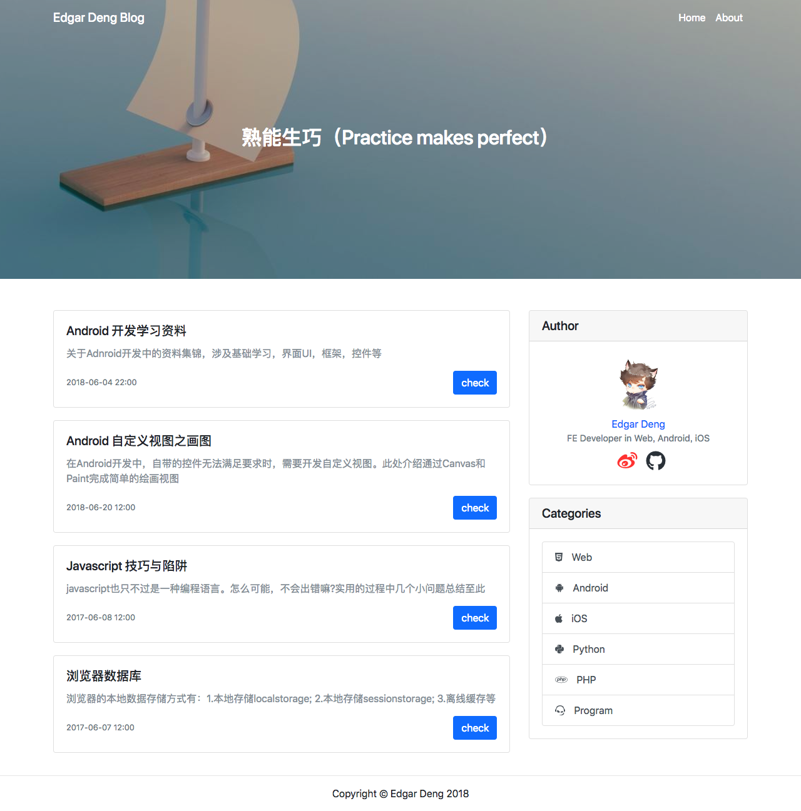

# edgardeng.github.io

[Edgar Deng Personal Blog](https://edgardeng.github.io )


## Structure

> Website for Personal Blog

```
  -- article
    -- android
    -- ios
    -- ...
    -- category.html 
    -- index.html 
    -- me.html 
  -- asset
   -- category.json 
   -- android.json 
   -- ...
  -- resource
      -- css
      -- fonts
      -- image
      -- js
  -- index.html
  
```

## Technology Stack 

* [Bootsrap](https://getbootstrap.com/) - an open source toolkit for developing with HTML, CSS, and JS. Quickly prototype your ideas or build your entire app with our Sass variables and mixins, responsive grid system, extensive prebuilt components, and powerful plugins built on jQuery.
 
* [Vue](https://vuejs.org/index.html) - The Progressive JavaScript Framework

* [JQuery](https://jquery.com/ ) - a fast, small, and feature-rich JavaScript library

* [showdown.js](http://showdownjs.com/) - A Markdown to HTML converter written in Javascript!

* [highlight.js](https://highlightjs.org/) - Syntax highlighting for the Web
