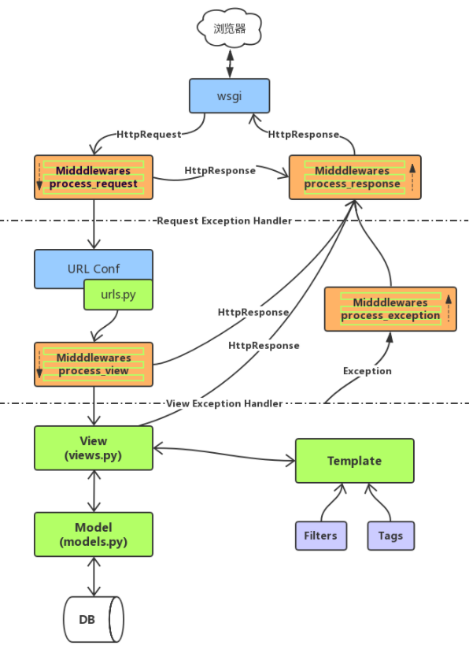

# Django的中间件

1. [中间件](https://docs.djangoproject.com/zh-hans/4.1/topics/http/middleware) 是一个用来处理Django的请求和响应的框架级别的钩子。
2. 是一个轻量、低级别的插件系统，用于在全局范围内改变Django的输入和输出。
    * 修改请求，即传送到 view 中的 HttpRequest 对象。
    * 修改响应，即 view 返回的 HttpResponse 对象
3. 每个中间件组件负责做一些特定的功能。

## 中间件是如何工作的

1. Django的请求相应流程：HttpRequest -> RequestMiddleware -> view function -> ResponseMiddleware -> HttpResponse

2. Django的middleware包含四个钩子函数：

   * process_request：接受request之后确定所执行的view之前
   * process_view(request, view_func, view_args, view_kwargs)：确定了所要执行的view之后，view真正执行之前
   * process_response：view执行之后
   * process_exception(request, exception)：view执行抛出异常

3. 在请求阶段，在调用视图之前，Django按照定义的顺序应用中间件MIDDLEWARE，自顶向下
4. 在响应阶段, 以相反的顺序, 响应将在返回的过程中通过每个层 




## 激活中间件

激活中间件组件，将其添加到 Django 设置中的 MIDDLEWARE 列表中。
每个中间件组件由字符串表示：指向中间件工厂的类或函数名的完整 Python 路径

```python
MIDDLEWARE = [
    'django.middleware.security.SecurityMiddleware',
    'django.contrib.sessions.middleware.SessionMiddleware',
    'django.middleware.common.CommonMiddleware',
    'django.middleware.csrf.CsrfViewMiddleware',
    'django.contrib.auth.middleware.AuthenticationMiddleware',
    'django.contrib.messages.middleware.MessageMiddleware',
    'django.middleware.clickjacking.XFrameOptionsMiddleware',
]
```

## 编写中间件：

1. 中间件类必须继承自django.utils.deprecation.MiddlewareMixin类
2. 中间件类必须实现下列五个方法中的一个或多个
   * process_request(self,request)：
    > 作用：执行主路由之前被掉用，在每个请求上调用，返回None(请求通过)或者HttpResponse对象(请求不通过)
    > 用途：过滤请求
   * process_view(self,request,callback,callback_args,callback_kwargs):
    > 作用：callback：为视图函数；callback_args：视图函数的位置参数,callback_kwargs：视图函数的关键字参数；调用视图之前被调用，在每个请求上调用，返回None(请求通过)或者HttpResponse对象(请求不通过)
    > 用途：用于代码层面的替换和过滤，这个方法可以拿到视图函数的参数
   * process_response(self,request,response)：
    > 作用：response：即是视图函数的响应对象；在所有响应返回浏览器之前被调用，在每个请求上调用，返回HttpResponse对象
   * process_exception(self,request,exception)：
    > 作用：处理过程中抛出异常时被调用，返回一个HttpResponse对象
    > 用途：用于一般用于捕获发生的异常，并将其邮件发送给开发人员
   * process_template_response(self,request,response)：
    > 作用：在视图函数执行完毕，且视图函数返回的对象中包含render方法时被调用；该方法需要返回实现了render方法的响应对象
    > 注：中间件中的大多数方法在返回None时表示忽略当前操作进入下一项事件,当返回HttpResponse对象时，表示此请求结束，直接返回给客户端

### 示例

添加过滤请求次数中间件

```python
# file:mymiddleware.py
from django.http import HttpResponse
from django.utils.deprecation import MiddlewareMixin
import re

class MWare(MiddlewareMixin):
  count_dict = {}  # 创建用于统计次数的字典
  def process_request(self, request):
    request_ip = request.META['REMOTE_ADDR']  # 获取请求IP
    request_url = request.path_info  # 获取请求URL
    if re.match(r'^/test', request_url):  # 匹配请求是否以/test开头
        times = self.count_dict.get(request_ip, 0)  # 查询当前IP的请求次数，默认为0
        self.count_dict[request_ip] = times + 1  # 请求次数 + 1
       if times < 5:  # 如果请求次数＜5次，请求正常通过
           return
       else:  # 如果请求次数＞5次，则返回HttpResponse，阻止请求
           return HttpResponse("访问次数超过5次，请求失败")
    else:  # 如果不是以/test开头则直接正常通过
        return
```

一个简单的示例

```python

class MDW(MiddlewareMixin):
  def process_request(self, request):
    print("md1  process_request 方法。", id(request)) #在视图之前执行
  def process_response(self,request, response): :#基于请求响应
    print("md1  process_response 方法！", id(request)) #在视图之后
    return response
  def process_view(self,request, view_func, view_args, view_kwargs):
    print("md1  process_view 方法！") #在视图之前执行 顺序执行
      #return view_func(request)
  def process_exception(self, request, exception):#引发错误 才会触发这个方法
    print("md1  process_exception 方法！")
    # return HttpResponse(exception) #返回错误信息
```


## [常用的中间件和相关顺序](https://docs.djangoproject.com/zh-hans/4.1/ref/middleware)

1. SecurityMiddleware 安全中间件
   >  为请求／响应周期提供了若干安全增强功能。每一项都可以通过设置独立地启用或禁用。
   > 如果你要开启 SSL 重定向，它应该排在列表的最前面，因为这样可以避免运行一堆其他不必要的中间件。

2. UpdateCacheMiddleware  缓存中间件
   > 启用全站缓存。如果启用了这些功能，那么每一个 Django 驱动的页面都会在 CACHE_MIDDLEWARE_SECONDS 配置定义的时间内被缓存
   在修改 Vary 头（SessionMiddleware、GZipMiddleware、LocaleMiddleware）之前。

3. GZipMiddleware
   > 为能理解 GZip 压缩的浏览器（所有现代浏览器）压缩内容
   在任何可能改变或使用响应体的中间件之前。
   > (安全研究人员最近发现，当在网站上使用压缩技术（包括 GZipMiddleware）时，网站可能会受到一些可能的攻击。)
   在 UpdateCacheMiddleware 之后：修改 Vary 头。

4. SessionMiddleware 启用会话支持

   在任何可能引发异常触发错误视图的中间件之前（如 PermissionDenied），如果你使用的是 CSRF_USE_SESSIONS。

   在 UpdateCacheMiddleware 之后：修改 Vary 头。

5. ConditionalGetMiddleware

   在任何可能改变响应的中间件之前（它设置 ETag 头）。

   在 GZipMiddleware 之后，这样它就不会在 gzip 压缩后的内容上计算 ETag 头。

6. LocaleMiddleware 本地化中间件
   > 根据请求的数据选择语言。它为每个用户定制内容
    最上面的一个，仅次于 SessionMiddleware （使用会话数据）和 UpdateCacheMiddleware （修改 Vary 头）。

7. CommonMiddleware 通用”中间件

   在任何可能改变响应的中间件之前（它设置 Content-Length 头）。出现在 CommonMiddleware 之前并改变响应的中间件必须重置 Content-Length。
   靠近顶部：当 APPEND_SLASH 或 PREPEND_WWW 设置为 True 时，它会重定向。
   在 SessionMiddleware 之后，如果你使用 CSRF_USE_SESSIONS。

8. CsrfViewMiddleware CSRF 保护中间件
   > 通过在 POST 表单中添加隐藏的表单字段，并检查请求的正确值，增加对跨站点伪造请求的保护
   在任何假设 CSRF 攻击已经被处理的视图中间件之前。
在 RemoteUserMiddleware，或任何其他可能执行登录的认证中间件，从而旋转 CSRF 令牌，然后再向下调用中间件链。
在 SessionMiddleware 之后，如果你使用 CSRF_USE_SESSIONS。

9. AuthenticationMiddleware 授权中间件

   SessionMiddleware 之后：使用会话存储。

10. MessageMiddleware 消息中间件
   > 启用基于 cookie 和会话的消息支持
   SessionMiddleware 之后：可以使用基于会话的存储。

11. FetchFromCacheMiddleware 缓存中间件

   在任何修改 Vary 头的中间件之后：该头用于为缓存哈希键选取一个值。

12. FlatpageFallbackMiddleware

   应该是接近底部，因为这是一种最后的中间件。

13. RedirectFallbackMiddleware

   应该是接近底部，因为这是一种最后的中间件。

