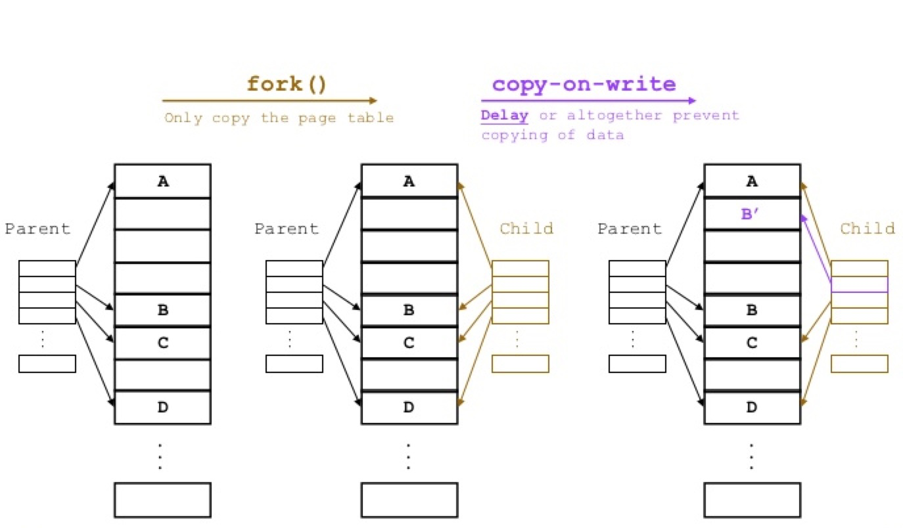

<!-- -->
# Redis 监控
> Redis 是一种内存数据库，将数据保存在内存中，读写效率要比传统的将数据保存在磁盘上的数据库要快很多

## 内存使用统计

通过 info memory 命令可以获得 Redis 内存相关的指标。 `以下测试来源Redis 5.0`

|属性名|说明|
|:-----|:-----|
|used_memory| Redis分配器分配的内存总量（数据内存占用总量）
|used_memory_human |可读格式
|used_memory_rss |操作系统角度Redis进程的物理内存总量
|used_memory_rss_human|  可读格式
|used_memory_peak|Redis 的内存消耗峰值
|used_memory_peak_human|可读格式
|used_memory_lua| Lua 引擎所使用的内存大小
|used_memory_lua_human|可读格式
|mem_fragmentation_ratio| used_memory_rss 和 used_memory 之间的比率
|mem_fragmentation_bytes|24528880
|maxmemory|Redis 能够使用的最大内存上限，0表示没有限制，以字节为单位。
|maxmemory_human|0B
|maxmemory_policy|淘汰策略 默认noeviction|

### 内存碎片率
> mem_fragmentation_ratio = used_memory_rss / used_memory

当 mem_fragmentation_ratio > 1 时，说明有部分内存并没有用于数据存储，而是被内存碎片所消耗，如果该值很大，说明碎片率严重。

当 mem_fragmentation_ratio < 1 时，这种情况一般出现在操作系统把 Redis 内存交换 (swap) 到硬盘导致，出现这种情况要格外关注，由于硬盘速度远远慢于内存，Redis 性能会变得很差，甚至僵死。

当 Redis 内存超出可以获得内存时，操作系统会进行 swap，将旧的页写入硬盘。从硬盘读写大概比从内存读写要慢5个数量级。
used_memory 指标可以帮助判断 Redis 是否有被swap的风险或者它已经被swap。

在[Redis Administration](https://redis.io/topics/admin/) 一文 建议要设置和内存一样大小的交换区，如果没有交换区，一旦 Redis 突然需要的内存大于当前操作系统可用内存时，Redis 会因为 out of memory 而被 Linix Kernel 的 OOM Killer 直接杀死。虽然当 Redis 的数据被换出 (swap out) 时，Redis的性能会变差，但是总比直接被杀死的好。


### max memory 

Redis 使用 max_memory 参数限制最大可用内存。限制内存的目的主要有:

 * 用于缓存场景，当超出内存上限 maxmemory 时使用 LRU 等删除策略释放空间。

 * 防止所用的内存超过服务器物理内存，导致 OOM 后进程被系统杀死。

max_memory 限制的是 Redis 实际使用的内存量，也就是 used_memory 统计项对应的内存。
实际消耗的内存可能会比 max_memory 设置的大，要小心因为这部内存导致 OOM。
所以，如果你有 10GB 的内存，最好将 maxmemory 设置为 8 或者 9G

### maxmemory-policy淘汰策略（默认：maxmemory-policy noeviction）
> 当 Redis 内存使用达到 maxmemory 时，需要选择设置好的 maxmemory-policy 进行对数据进行淘汰机制。

1. volatile-lru(least recently used):最近最少使用算法，从设置了过期时间的键key中选择空转时间最长的键值对清除掉；

2. volatile-lfu(least frequently used):最近最不经常使用算法，从设置了过期时间的键中选择某段时间之内使用频次最小的键值对清除掉；

3. volatile-ttl:从设置了过期时间的键中选择过期时间最早的键值对清除；

4. volatile-random:从设置了过期时间的键中，随机选择键进行清除；

5. allkeys-lru:最近最少使用算法，从所有的键中选择空转时间最长的键值对清除；

6. allkeys-lfu:最近最不经常使用算法，从所有的键中选择某段时间之内使用频次最少的键值对清除；

7. allkeys-random:所有的键中，随机选择键进行删除；

8. noeviction:不做任何的清理工作，在redis的内存超过限制之后，所有的写入操作都会返回错误；但是读操作都能正常的进行;
        
## 内存消耗划分
Redis 进程内消耗主要包括：自身内存 + 对象内存 + 缓冲内存 + 内存碎片

Redis 空进程自身内存消耗非常少，通常 usedmemoryrss 在 3MB 左右时，used_memory 一般在 800KB 左右，一个空的 Redis 进程消耗内存可以忽略不计。

### 对象内存
对象内存是 Redis 内存占用最大的一块，存储着用户所有的数据。Redis 所有的数据都采用 key-value 数据类型，每次创建键值对时，至少创建两个类型对象：key 对象和 value 对象。
对象内存消耗可以简单理解为这两个对象的内存消耗之和(还有类似过期之类的信息)。
键对象都是字符串，在使用 Redis 时很容易忽略键对内存消耗的影响，应当避免使用过长的键。

### 缓冲内存
缓冲内存主要包括：客户端缓冲、复制积压缓冲区和 AOF 缓冲区。

客户端缓冲指的是所有接入到 Redis 服务器 TCP 连接的输入输出缓冲。

输入缓冲无法控制，最大空间为 1G，如果超过将断开连接。而且输入缓冲区不受 maxmemory 控制，假设一个 Redis 实例设置了 maxmemory 为 4G，已经存储了 2G 数据，但是如果此时输入缓冲区使用了 3G，就已经超出了 maxmemory 限制，可能导致数据丢失、键值淘汰或者 OOM。

输入缓冲区过大主要是因为 Redis 的处理速度跟不上输入缓冲区的输入速度，并且每次进入输入缓冲区的命令包含了大量的 bigkey。

输出缓冲通过参数 client-output-buffer-limit 控制，其格式如下所示。

client-output-buffer-limit [hard limit] [soft limit] [duration]

hard limit 是指一旦缓冲区大小达到了这个阈值，Redis 就会立刻关闭该连接。而 soft limit 和时间 duration 共同生效，比如说 soft time 为 64mb、duration 为 60，则只有当缓冲区持续 60s 大于 64mb 时，Redis 才会关闭该连接。

#### 普通客户端
> 普通客户端是除了复制和订阅的客户端之外的所有连接。
Reids 对其的默认配置是 client-output-buffer-limit normal 0 0 0 , Redis 并没有对普通客户端的输出缓冲区做限制，一般普通客户端的内存消耗可以忽略不计，但是当有大量慢连接客户端接入时这部分内存消耗就不能忽略，可以设置 maxclients 做限制。
特别当使用大量数据输出的命令且数据无法及时推送到客户端时，如 monitor 命令，容易造成 Redis 服务器内存突然飙升。

#### 从客户端
从客户端用于主从复制，主节点会为每个从节点单独建立一条连接用于命令复制，默认配置为 client-output-buffer-limit slave 256mb 64mb 60。当主从节点之间网络延迟较高或主节点挂载大量从节点时这部分内存消耗将占用很大一部分，建议主节点挂载的从节点不要多于 2 个，主从节点不要部署在较差的网络环境下，如异地跨机房环境，防止复制客户端连接缓慢造成溢出。与主从复制相关的一共有两类缓冲区，一个是从客户端输出缓冲区，另外一个是下面会介绍到的复制积压缓冲区。

#### 订阅客户端
订阅客户端用于发布订阅功能，连接客户端使用单独的输出缓冲区，默认配置为 client-output-buffer-limit pubsub 32mb 8mb 60，当订阅服务的消息生产快于消费速度时，输出缓冲区会产生积压造成内存空间溢出。

输入输出缓冲区在大流量场景中容易失控，造成 Redis 内存不稳定，需要重点监控。可以定期执行 client list 命令，监控每个客户端的输入输出缓冲区大小和其他信息。

##### client list 命令
> client list 命令执行速度慢，客户端较多时频繁执行存在阻塞redis的可能，所以一般可以先使用 info clients 命令获取最大的客户端缓冲区大小。
```
# client list
id=3 addr=127.0.0.1:58161 fd=8 name= \ age=1408 idle=0 flags=N db=0 sub=0 psub=0 multi=-1 \ qbuf=26 qbuf-free=32742 obl=0 oll=0 omem=0 \ events=r cmd=client

# info clients
connected_clients:1
client_recent_max_input_buffer:2
client_recent_max_output_buffer:0
blocked_clients:0

```

|属性名|说明|
|:----|:----|
|qbuf       |查询缓冲区的长度 字节单位|
|qbuf-free  |查询缓冲区剩余空间的长度|
|obl        |输出缓冲区的长度|
|oll        |输出列表包含的对象数量（当输出缓冲区没有剩余空间时，命令回复以字符串对象形式被入队到队列中）|


**复制积压缓冲区**是Redis 在 2.8 版本后提供的一个可重用的固定大小缓冲区，用于实现部分复制功能。
根据 repl-backlog-size 参数控制，默认 1MB。对于复制积压缓冲区整个主节点只有一个，所有的从节点共享此缓冲区。因此可以设置较大的缓冲区空间，比如说 100MB，可以有效避免全量复制。

**AOF 重写缓冲区**：这部分空间用于在 Redis AOF 重写期间保存最近的写入命令。

AOF 重写缓冲区的大小用户无法控制，取决于 AOF 重写时间和写入命令量，不过一般都很小。

###  Redis 内存碎片

Redis 默认的内存分配器采用 jemalloc，可选的分配器还有：glibc、tcmalloc。内存分配器为了更好地管理和重复利用内存，分配内存策略一般采用固定范围的内存块进行分配。
具体的分配策略后续会具体讲解，但是 Redis 正常碎片率一般在 1.03 左右(为什么是这个值)。但是当存储的数据长度长度差异较大时，以下场景容易出现高内存碎片问题：

 * 频繁做更新操作，例如频繁对已经存在的键执行 append、setrange 等更新操作。

 * 大量过期键删除，键对象过期删除后，释放的空间无法得到重复利用，导致碎片率上升。

这部分内容我们后续再详细讲解 jemalloc，因为大量的框架都会使用内存分配器，比如说 Netty 等。

###  子进程内存消耗
子进程内存消耗主要指执行 AOF 重写 或者进行 RDB 保存时 Redis 创建的子进程内存消耗。Redis 执行 fork 操作产生的子进程内存占用量表现为与父进程相同，理论上需要一倍的物理内存来完成相应的操作。但是 Linux 具有写时复制技术 (copy-on-write)，父子进程会共享相同的物理内存页，当父进程处理写请求时会对需要修改的页复制出一份副本完成写操作，而子进程依然读取 fork 时整个父进程的内存快照。



如上图所示，fork 时只拷贝 page table，也就是页表。只有等到某一页发生修改时，才真正进行页的复制。

但是 Linux Kernel 在 2.6.38 内存增加了 Transparent Huge Pages (THP) 机制，简单理解，它就是让页大小变大，本来一页为 4KB，开启 THP 机制后，一页大小为 2MB。它虽然可以加快 fork 速度( 要拷贝的页的数量减少 )，但是会导致 copy-on-write 复制内存页的单位从 4KB 增大为 2MB，如果父进程有大量写命令，会加重内存拷贝量，都是修改一个页的内容，但是页单位变大了，从而造成过度内存消耗。例如，以下两个执行 AOF 重写时的内存消耗日志：

```
// 开启 THP
C * AOF rewrite: 1039 MB of memory used by copy-on-write

// 关闭 THP
C * AOF rewrite: 9MB of memory used by copy-on-write
```


这两个日志出自同一个 Redis 进程，used_memory 总量是 1.5GB，子进程执行期间每秒写命令量都在 200 左右。当分别开启和关闭 THP 时，子进程内存消耗有天壤之别。所以，在高并发写的场景下开启 THP，子进程内存消耗可能是父进程的数倍，造成机器物理内存溢出。

所以说，Redis 产生的子进程并不需要消耗 1 倍的父进程内存，实际消耗根据期间写入命令量决定，所以需要预留一些内存防止溢出。并且建议关闭系统的 THP，防止 copy-on-write 期间内存过度消耗。不仅是 Redis，部署 MySQL 的机器一般也会关闭 THP。

## 参考

* [美团在REDIS上踩过的一些坑-3.REDIS内存占用飙升](https://www.iteye.com/blog/carlosfu-2254154)

* [一文了解 Redis 内存监控和内存消耗](https://blog.csdn.net/u012422440/article/details/102576777)